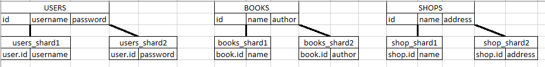

# Домашнее задание к занятию «Репликация и масштабирование. Часть 2» Сафронов П.А.

### Задание 1

Опишите основные преимущества использования масштабирования методами:

- активный master-сервер и пассивный репликационный slave-сервер;
- master-сервер и несколько slave-серверов;
```
По сути оба метода предназначены для повышения отказоустойчивости и позволяют распределять нагрузку чтения информации с БД.
Но в зависимости от количества подчиненных серверов - повышается вероятность потери данных при выходе из строя мастер сервера,
т.к. данные могут по каким-либо причинам неполностью скопироваться на сервера репликации.
```

*Дайте ответ в свободной форме.*

---

### Задание 2


Разработайте план для выполнения горизонтального и вертикального шаринга базы данных. База данных состоит из трёх таблиц: 

- пользователи, 
- книги, 
- магазины (столбцы произвольно). 

Опишите принципы построения системы и их разграничение или разбивку между базами данных.

*Пришлите блоксхему, где и что будет располагаться. Опишите, в каких режимах будут работать сервера.* 

Рис. 1. Пример вертикального шардинга

